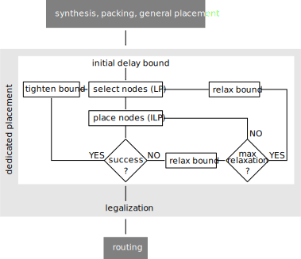

# Timing-Driven Placement for FPGA Architectures with Dedicated Routing Paths

This repository holds an implementation of a timing-driven detailed placer for FPGA architectures with direct connections between LUTs.

For detailed background on the placement algorithm, please refer to:

S. Nikolić, G. Zgheib, and P. Ienne, "Timing-Driven Placement for FPGA Architectures with Dedicated Routing Paths", FPL'20

Please cite the same paper when using this algorithm.

Further information on the architectures themselves can be found in:

[S. Nikolić, G. Zgheib, and P. Ienne, "Straight to the Point: Intra- and Intercluster LUT Connections to Mitigate the Delay of Programmable Routing", FPGA'20](https://doi.org/10.1145/3373087.3375315)

## Overview

The overall flow of the placer, along with its position in a standard FPGA CAD flow is shown in the figure above.
The whole process is performed by **main.py**. The selection of movable nodes by construction and solving of the
appropriate linear program is done by **selector.py**, which also provides the initial delay bound.
Construction of the related placement ILP starts in **feeder.py** which
expands the movement regions of the movable nodes, while the encoding itself is performed by **ilp.py**, which also calls
the appropriate solver and reconstructs the solution. Finally, removal of overlaps between movable and stationary nodes
is done by **legalizer.py**.

## Requirements

This implementation requires Python 2.7 or higher and NetworkX 2.0 or higher.
As the LP/ILP solver, we have been using CPLEX 12.10. In principle, any other solver that can read the CPLEX LP format
should be immediately usable, if the appropriate solution parser is provided. We provide parsers for GLPK 4.65 as well,
although the time it takes to solve a typical placement ILP may be prohibitive.

## Configuration

There are many control parameters in the algorithm. They are always defined as global variables at the beginning of the
source file in which they have influence, followed by a comment describing their behavior. The currently assigned values
are the ones used to produce the results of the FPL'20 paper.

Changing these parameters may lead to improved results and/or shorter solution times. Note that because of the timeout,
results will generally depend on the platform on which the placer is running. 

## Running

Running the placer is achieved by running **main.py** with the benchmark name and the placement seed specified as command
line arguments. The code assumes that the necessary input files are stored in **import\_dir/**.

## Input files

The object on which the algorithm operates is a directed graph representing the circuit netlist, with all nodes annotated by their
coordinates on the FPGA grid after generic placement, and all edges annotated by the corresponding delay.

We provide these graphs for the benchmark circuits and the placement seeds used in the paper in **import\_dir.tar.gz**.

A small script that produced them is also included, in **pickle_tgs.py**.

Aside from the timing graph of the circuit, a map of delays between each pair of coordinates in the FPGA grid is also needed,
as is a map of the block types.

Finally, a straightforward description of the direct connection pattern (e.g., **best_pattern_i13.txt**) along with their delays
is needed as well.

All of these are provided in the aforementioned archive, for the architecture used in the paper.

## Output

The output is written to **cls.out** and lists each cluster designated by its coordinates, followed by a list of LUTs residing in
it, each written on a separate line. First, the position of the LUT is reported, with -1 designating that the LUT has no incident
direct connections and that hence its exact position is irrelevant, followed by the name of the net that the LUT drives.

## License

**LICENSE** applies to all the source files in this repository.

## Contact

If you find any bugs please open an issue. For all other questions, please contact Stefan Nikolić (firstname dot lastname at epfl dot ch). This includes getting access to VTR-7 modifications and integration scripts that were used to enable routing on architectures with direct connections.
